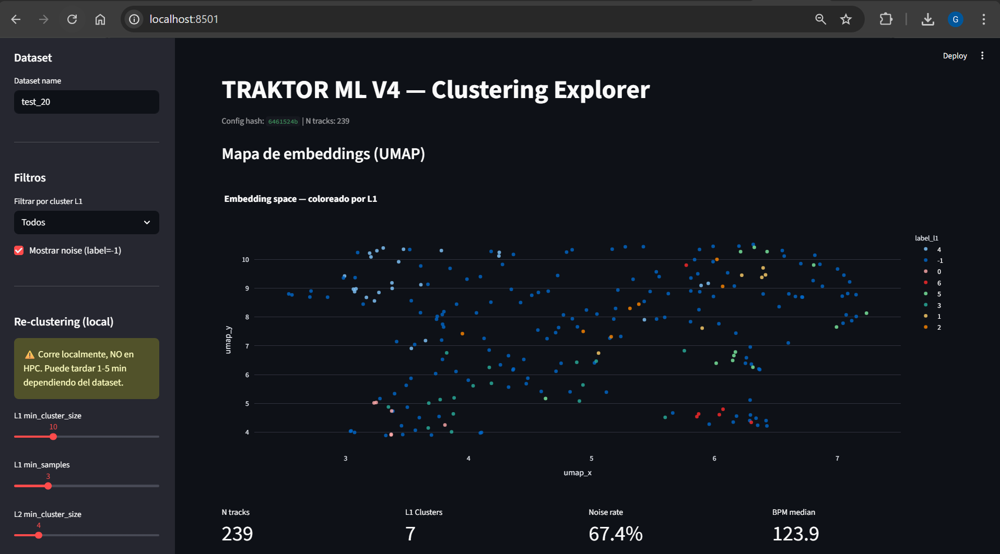

# TRAKTOR ML

Personal project. Not reproducible.

ML pipeline to analyze, classify, and organize an electronic music collection (Techno / Tech House). It extracts audio embeddings with MERT and Demucs, groups tracks by rhythmic and timbral similarity with hierarchical HDBSCAN, and exports M3U playlists ready to import into Traktor DJ.



---

## Architecture

| Where | What it does |
|---|---|
| **HPC (GPU)** | Feature extraction (Phases 0-1) - takes ~1h for ~250 tracks |
| **Login node / debug** | Clustering and export (Phases 2-5) - ~5 min, CPU only |
| **Local Windows** | Interactive visualization and playlist use in Traktor DJ |

---

## View the UI from your Windows computer

The UI is a Streamlit dashboard that shows the interactive UMAP, the clusters, and lets you re-export playlists.

**1. Open PowerShell and connect with an SSH tunnel:**

```powershell
ssh -L 8501:localhost:8501 datamove1
```

**2. In the SSH session, activate the environment and start Streamlit:**

```bash
conda activate traktor_ml
cd /mnt/fast/nobackup/users/gb0048/traktor
streamlit run src/v4/ui/app.py --server.port 8501
```

**3. Open this in your Windows browser:**

```
http://localhost:8501
```

Keep PowerShell open while you use the UI.

---

## Full pipeline (HPC)

### Phase 0 - Ingestion (login node, ~1 min)

```bash
python src/v4/pipeline/phase0_ingest.py --dataset-name test_20
```

### Phase 1 - Feature extraction (GPU, ~1h)

```bash
./slurm/tools/on_submit.sh sbatch slurm/jobs/v4/phase1_extract.job test_20
./slurm/tools/on_submit.sh sbatch slurm/jobs/v4/phase1_merge.job test_20
```

### Phases 2-5 - Clustering, naming, ordering, export (~5 min)

```bash
./slurm/tools/on_submit.sh sbatch slurm/jobs/v4/phase2_to_5.job test_20
```

The playlists are generated in `playlists/V4_<N>/` with Windows paths ready for Traktor.

---

## Repository structure

```text
src/v4/pipeline/     # Scripts for each phase (0-5)
src/v4/common/       # Shared utilities
src/v4/ui/           # Streamlit dashboard
slurm/jobs/v4/       # Slurm jobs
artifacts/v4/        # Generated artifacts (embeddings, clustering)
playlists/           # Exported M3U files
config/v4.yaml       # Main configuration
tests/v4/            # Block-level integration tests
docs/                # Detailed documentation
```

---

## Documentation

- [`docs/V4_USAGE.md`](docs/V4_USAGE.md) - Complete usage guide
- [`docs/PROJECT_MAP.md`](docs/PROJECT_MAP.md) - File map
- [`docs/v4/JOBS_STATUS.md`](docs/v4/JOBS_STATUS.md) - Status of jobs and validated artifacts
- [`docs/LESSONS_LEARNED.md`](docs/LESSONS_LEARNED.md) - Lessons learned (HPC, models, bugs)
